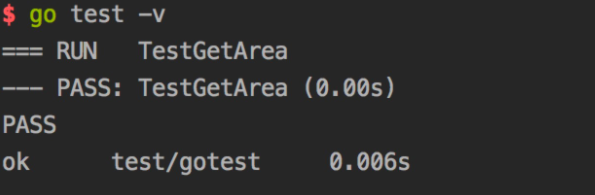
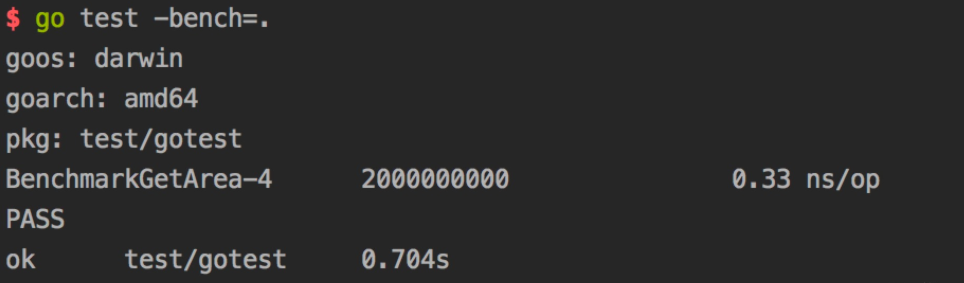
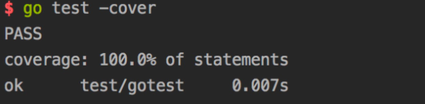

## Golang的测试框架

This page updated at: **2018/10/22**

### 前言

每种语言都有自己的测试姿势，golang的作者提供了一个testing的包来供大家完成测试之旅，简单好用，一起走一波。

10s后以下知识点即将靠近： 

* 1.为什么需要测试？ 
* 2.Golang的测试规矩 
* 3.功能测试 
* 4.压力测试 
* 5.测试代码的覆盖率测试 
* 6.测试所有的参数备忘

### 1.为什么需要测试？

这个是一个老生常谈的话题了，忘记哪里看的数据了，表明是完善的测试体系（这里主要指自测），其实是会提高开发效率的。

当项目足够复杂的时候，想要保证尽可能少的bug，两种方式最有效：1.代码审核 2.测试。

所以Golang官方提供了testing包来满足大家的需求。

### 2.Golang的测试规矩

通过testing包我们主要是可以进行三个测试的姿势：1.功能测试 2.压力测试 3.测试代码覆盖率的测试(你写的测试用例覆盖了多少代码)。

在介绍以上三点之前，有一些Golang官方的一些约定（也可以说测试规矩）是需要遵守的，否则Golang是不承认你写的测试代码的。

关键点 | 说明
:- | :-
导入需要的包 | import testing (如果你是goland,那么可以忽略，因为ide就自动帮你加上)
执行命令 | go test file_test.go
测试文件命名 | 必须以_test.go结尾
功能测试的用力函数 | 必须以Test开头&&后头跟着的函数名不能以小写字母开头，比如：Testcbs 就是不行的，TestCbs就是ok的
功能测试参数 | testing.T
压力测试用例函数 | 必须以Benchmark开头&&其后的函数名不能以小写字母开头(例子同上)
压力测试参数 | testing.B
测试信息 | .Log方法，默认情况下是不会显示的，只有在go test -v的时候显示
测试控制 | 通过Error/Errorf/FailNow/Fatal等来进行测试是否是失败，或者在失败的情况下的控制
压力测试命令 | go test -test.bench file_test.go
压力测试的循环体 | 使用test.B.N

### 3.功能测试

我创建了一个文件夹gotest，里头存在两个文件：1.正式文件cbstest.go 2.测试文件cbstest_test.go

上代码: 

> cbstest.go

```golang
package gotest

// 根据长宽获取面积
func GetArea(weight int, height int) int {
    return weight*height
}
```

> cbstest_test.go:

```golang
package gotest

import "testing"

func TestGetArea(t *testing.T) {
    area := GetArea(40, 50)
    if area != 2000 {
        t.Error("测试失败")
    }
}
```



### 4.压力测试

cbstest_test.go改造代码为压力测试：

```golang
package gotest

import "testing"

func BenchmarkGetArea(t *testing.B) {

    for i := 0; i < t.N; i++ {
        GetArea(40, 50)
    }
}
```



### 5.测试代码的覆盖率测试

执行命令：go test -cover



> 需要特别说明的是，测试的覆盖度正常情况下是跑不满100%，比如说写的代码是来接住panic的等等异常的，那其实就不会走到了。

### 6.测试所有的参数备忘

The test binary also accepts flags that control execution of the test; these 
flags are also accessible by ‘go test’.

```shell
    -bench regexp
        Run only those benchmarks matching a regular expression.
        By default, no benchmarks are run.
        To run all benchmarks, use '-bench .' or '-bench=.'.
        The regular expression is split by unbracketed slash (/)
        characters into a sequence of regular expressions, and each
        part of a benchmark's identifier must match the corresponding
        element in the sequence, if any. Possible parents of matches
        are run with b.N=1 to identify sub-benchmarks. For example,
        given -bench=X/Y, top-level benchmarks matching X are run
        with b.N=1 to find any sub-benchmarks matching Y, which are
        then run in full.

    -benchtime t
        Run enough iterations of each benchmark to take t, specified
        as a time.Duration (for example, -benchtime 1h30s).
        The default is 1 second (1s).

    -count n
        Run each test and benchmark n times (default 1).
        If -cpu is set, run n times for each GOMAXPROCS value.
        Examples are always run once.

    -cover
        Enable coverage analysis.
        Note that because coverage works by annotating the source
        code before compilation, compilation and test failures with
        coverage enabled may report line numbers that don't correspond
        to the original sources.

    -covermode set,count,atomic
        Set the mode for coverage analysis for the package[s]
        being tested. The default is "set" unless -race is enabled,
        in which case it is "atomic".
        The values:
            set: bool: does this statement run?
            count: int: how many times does this statement run?
            atomic: int: count, but correct in multithreaded tests;
                    significantly more expensive.
        Sets -cover.

    -coverpkg pattern1,pattern2,pattern3
        Apply coverage analysis in each test to packages matching the patterns.
        The default is for each test to analyze only the package being tested.
        See 'go help packages' for a description of package patterns.
        Sets -cover.

    -cpu 1,2,4
        Specify a list of GOMAXPROCS values for which the tests or
        benchmarks should be executed. The default is the current value
        of GOMAXPROCS.

    -failfast
        Do not start new tests after the first test failure.

    -list regexp
        List tests, benchmarks, or examples matching the regular expression.
        No tests, benchmarks or examples will be run. This will only
        list top-level tests. No subtest or subbenchmarks will be shown.

    -parallel n
        Allow parallel execution of test functions that call t.Parallel.
        The value of this flag is the maximum number of tests to run
        simultaneously; by default, it is set to the value of GOMAXPROCS.
        Note that -parallel only applies within a single test binary.
        The 'go test' command may run tests for different packages
        in parallel as well, according to the setting of the -p flag
        (see 'go help build').

    -run regexp
        Run only those tests and examples matching the regular expression.
        For tests, the regular expression is split by unbracketed slash (/)
        characters into a sequence of regular expressions, and each part
        of a test's identifier must match the corresponding element in
        the sequence, if any. Note that possible parents of matches are
        run too, so that -run=X/Y matches and runs and reports the result
        of all tests matching X, even those without sub-tests matching Y,
        because it must run them to look for those sub-tests.

    -short
        Tell long-running tests to shorten their run time.
        It is off by default but set during all.bash so that installing
        the Go tree can run a sanity check but not spend time running
        exhaustive tests.

    -timeout d
        If a test binary runs longer than duration d, panic.
        If d is 0, the timeout is disabled.
        The default is 10 minutes (10m).

    -v
        Verbose output: log all tests as they are run. Also print all
        text from Log and Logf calls even if the test succeeds.

    -vet list
        Configure the invocation of "go vet" during "go test"
        to use the comma-separated list of vet checks.
        If list is empty, "go test" runs "go vet" with a curated list of
        checks believed to be always worth addressing.
        If list is "off", "go test" does not run "go vet" at all.
```

The following flags are also recognized by ‘go test’ and can be used to 
profile the tests during execution:

```shell
    -benchmem
        Print memory allocation statistics for benchmarks.

    -blockprofile block.out
        Write a goroutine blocking profile to the specified file
        when all tests are complete.
        Writes test binary as -c would.

    -blockprofilerate n
        Control the detail provided in goroutine blocking profiles by
        calling runtime.SetBlockProfileRate with n.
        See 'go doc runtime.SetBlockProfileRate'.
        The profiler aims to sample, on average, one blocking event every
        n nanoseconds the program spends blocked. By default,
        if -test.blockprofile is set without this flag, all blocking events
        are recorded, equivalent to -test.blockprofilerate=1.

    -coverprofile cover.out
        Write a coverage profile to the file after all tests have passed.
        Sets -cover.

    -cpuprofile cpu.out
        Write a CPU profile to the specified file before exiting.
        Writes test binary as -c would.

    -memprofile mem.out
        Write a memory profile to the file after all tests have passed.
        Writes test binary as -c would.

    -memprofilerate n
        Enable more precise (and expensive) memory profiles by setting
        runtime.MemProfileRate. See 'go doc runtime.MemProfileRate'.
        To profile all memory allocations, use -test.memprofilerate=1
        and pass --alloc_space flag to the pprof tool.

    -mutexprofile mutex.out
        Write a mutex contention profile to the specified file
        when all tests are complete.
        Writes test binary as -c would.

    -mutexprofilefraction n
        Sample 1 in n stack traces of goroutines holding a
        contended mutex.

    -outputdir directory
        Place output files from profiling in the specified directory,
        by default the directory in which "go test" is running.

    -trace trace.out
        Write an execution trace to the specified file before exiting.
```