## Attempt 01

- internal DNS only
- private IP
- private domain
- self signed CA and certs

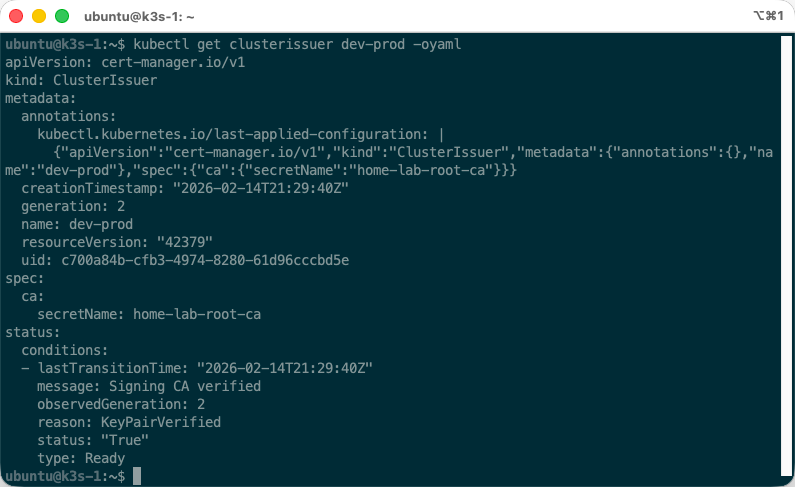

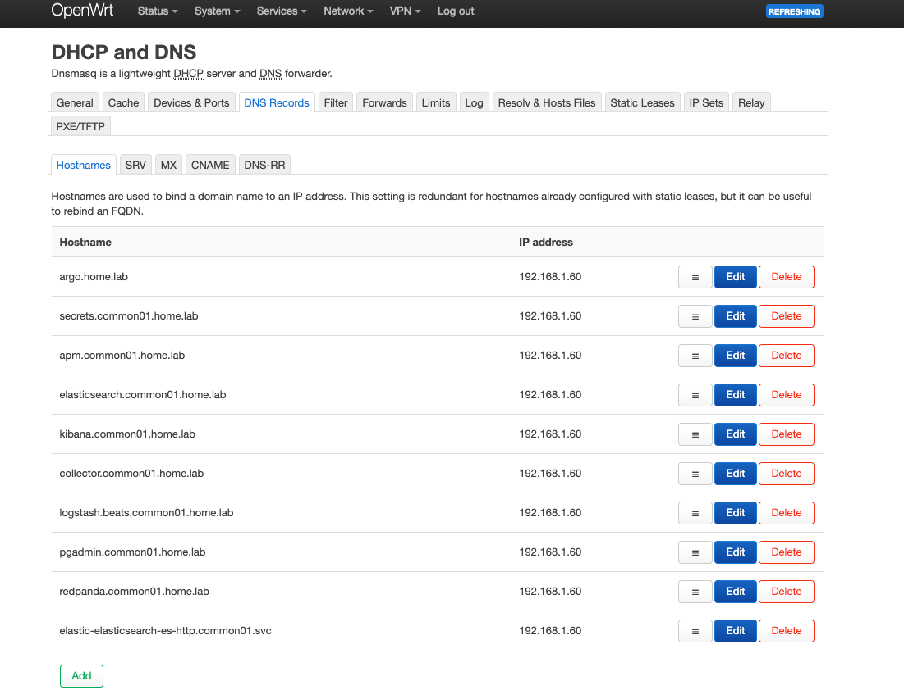

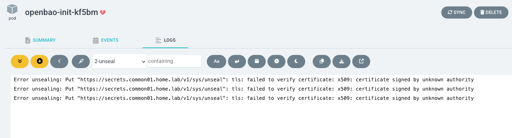


## Attempt 02

- internal DNS
- private IP
- **public** domain
- Let's Encrypt for public CA and certs

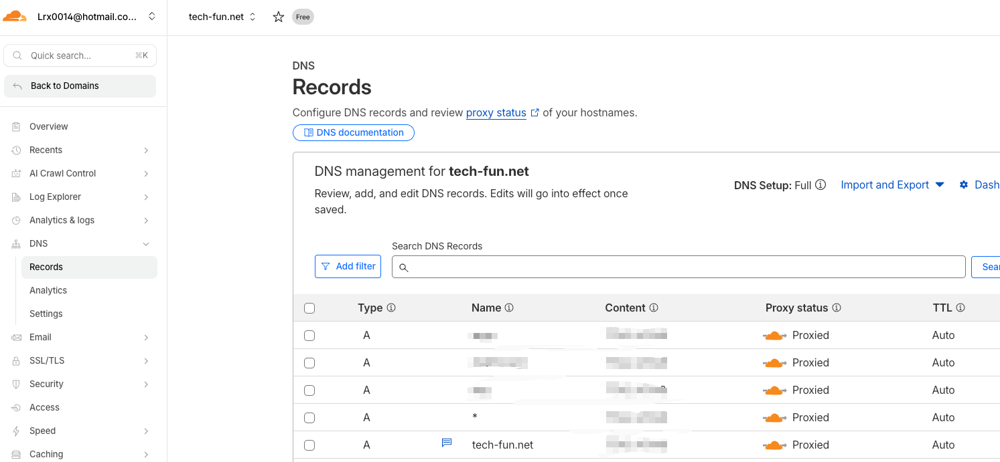

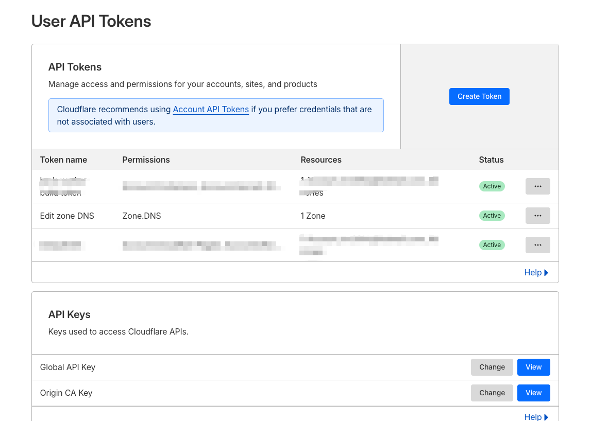

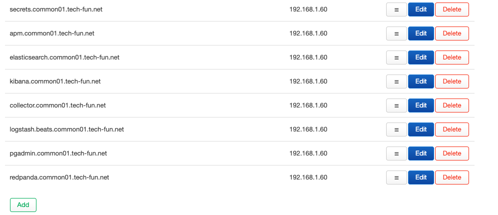

```yaml
apiVersion: v1
kind: Secret
metadata:
  name: cloudflare-api-token-secret
  namespace: cert-manager
type: Opaque
stringData:
  api-token: <cf-api-token>
---
apiVersion: cert-manager.io/v1
kind: ClusterIssuer
metadata:
  name: cf-dns01
spec:
  acme:
    email: xxx@hotmail.com
    server: https://acme-v02.api.letsencrypt.org/directory
    privateKeySecretRef:
      name: letsencrypt-account-key
    solvers:
    - dns01:
        cloudflare:
          email: xxx@hotmail.com
          apiTokenSecretRef:
            name: cloudflare-api-token-secret
            key: api-token
```

```shell
ubuntu@k3s-1:~/yamls$ kubectl get clusterissuers
NAME                         READY   AGE
cf-dns01                     True    50m
dev-prod                     True    47h
elk-clusterissuer-common01   True    38m
letsencrypt                  True    2d2h
```

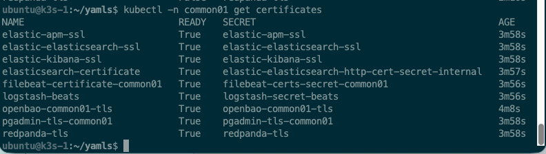

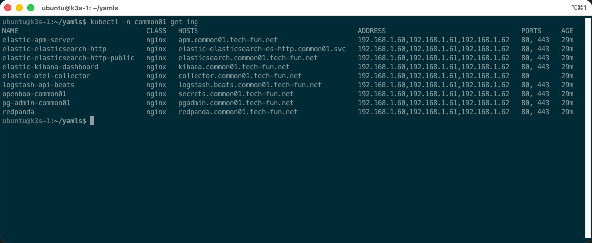

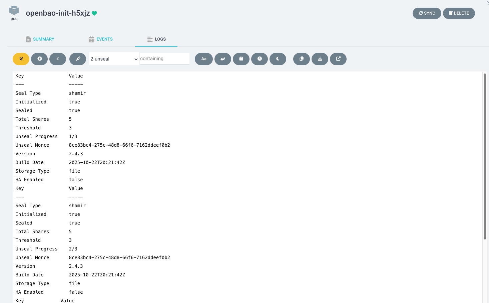

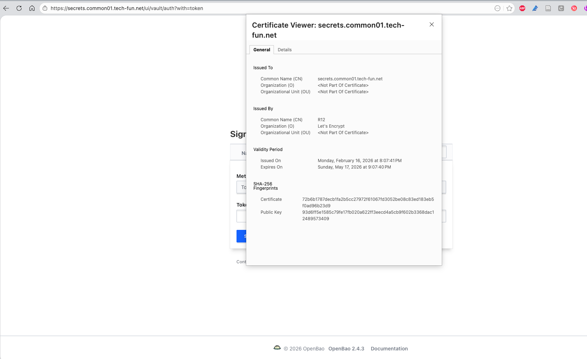

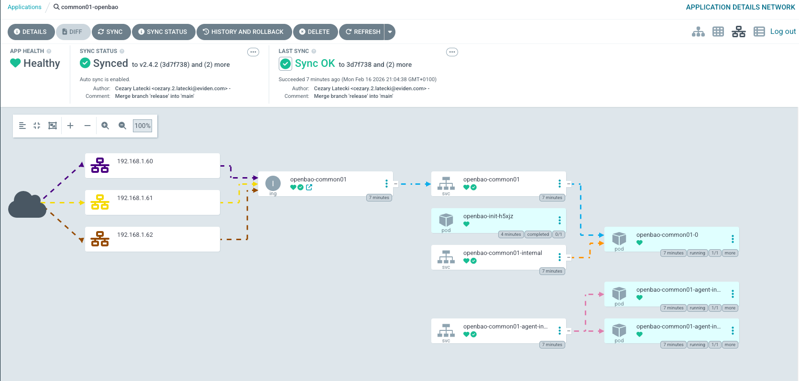

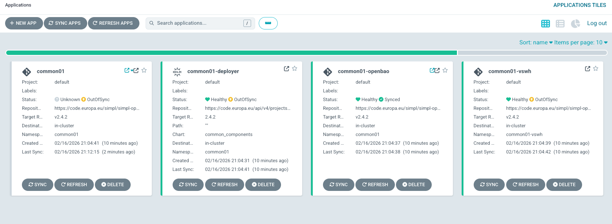

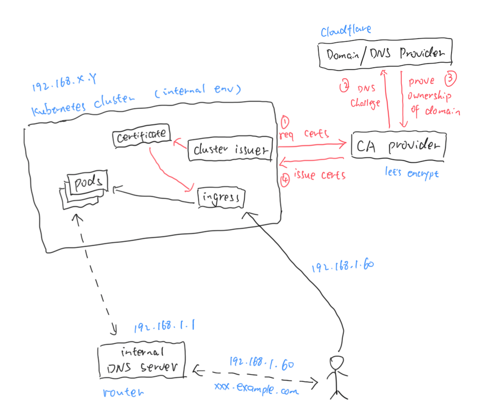

the manifest for the success case:
```yaml
apiVersion: argoproj.io/v1alpha1
kind: Application
metadata:
  name: 'common01-deployer' 
  namespace: argocd 
spec:
  project: default
  source:
    repoURL: 'https://code.europa.eu/api/v4/projects/951/packages/helm/stable'
    path: '""'
    targetRevision: 2.4.2 
    helm:
      values: |
        values:
          branch: v2.4.2   
        resourcePreset: default    # change it to 'low' for less resource requirement
        agentList:              
          authorities:
            - authority01
          consumers:
            - consumer01
          providers:
            - dataprovider01
        project: default          
        namespaceTag: common01   
        domainSuffix: example.com                   # your domain
        argocd:
          appname: common01                      
          namespace: argocd       
        cluster:
          # FQDN Fully Qualified Domain Name of your kubernetes cluster
          address: https://kubernetes.default.svc
          namespace: common01               
          issuer: cf-dns01                          # issuer of certificate
          internalIssuer: cf-dns01                  # issuer of self-signed certificates
          kubeStateHost: kube-prometheus-stack-kube-state-metrics.devsecopstools.svc.cluster.local:8080   
        secrets:
          secretEngine: example      
          role: example-role    
        kafka:
          ha: false                                  # set to false creates 1 of each, if true creates 3 replicas
          topic:
            autocreate: true
        mailpit:
          enabled: false
        monitoring:
          enabled: true
    chart: common_components
  destination:
    server: 'https://kubernetes.default.svc'
    namespace: common01
```

## Resource Usage

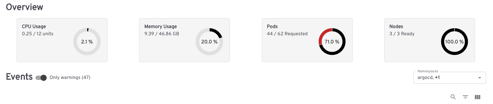

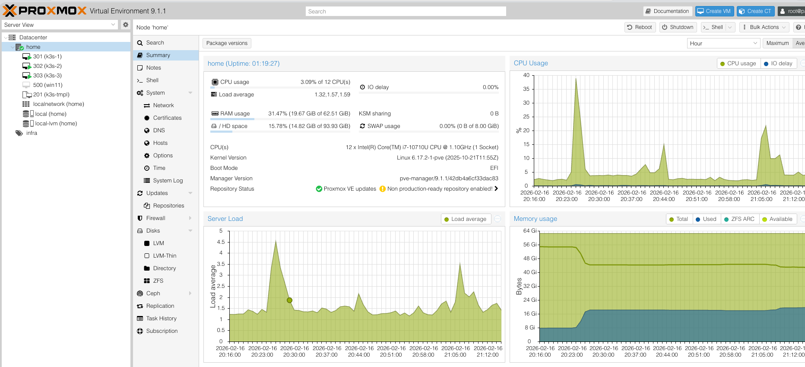