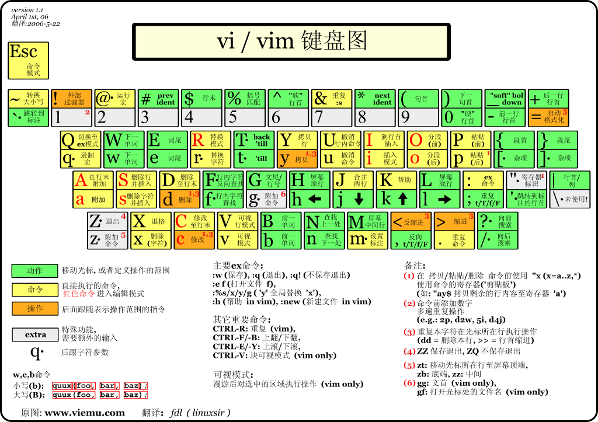

# Vim中如何快速进行光标移动

This page updated at: **2019/01/02**

vim提供的移动方式多如牛毛，但我们并不需要掌握全部这些命令，只需要掌握最适合自己的那些命令。因为我们最终的目的，并不是成为一个vim高手，而是更高效的编辑文本。

我们下面介绍的命令，如果没有特别说明，都是在Normal模式下使用的命令。

这些命令的帮助入口，就是":help 命令名"。例如，对于"j"命令，查看它的帮助，使用":help j"。

## [上下左右]

让我们从最简单的、也是使用频率最高的h, j, k, l开始。

h, j, k, l的移动方式，已经成为vim的标志之一，并且也为更多的软件所接受。如果你仍在用上下左右光标来移动的话，说明你内心并没有真正接受vim的哲学，如果真的打算把vim做为你的编辑工具，就从使用h, j, k, l开始吧！

h, j, k, l分别代表向左、下、上、右移动。如同许多vim命令一样，可以在这些键前加一个数字，表示移动的倍数。例如，"10j"表示向下移动10行；"10l"表示向右移动10列。

缺省情况下，h和l命令不会把光标移出当前行。如果已经到了行首，无论按多少次h键，光标始终停留在行首，l命令也类似。如果希望h和l命令可以移出当前行，更改'whichwrap'选项的设置(:help 'whichwrap')。

vim的作者在安排按键功能时别具匠心，在其它的键绑定中，也能看到h, j, k, l所代表的含义。

例如，使光标在多个窗口间上下左右移动的命令，就是CTRL-W h/j/k/l (:help CTRL-W_h, ...)；

再如，上下左右移动窗口位置的命令，是CTRL-W H/J/K/L (:help CTRL-W_H, ...)。注意，这里的H, J, K, L是大写的。

## [ 翻页 ]

在vim中翻页，同样可以使用PageUp和PageDown，不过，像使用上下左右光标一样，你的手指会移出主键盘区。因此，我们通常使用CTRL-B和CTRL-F来进行翻页，它们的功能等同于PageUp和PageDown。CTRL-B和CTRL-F前也可以加上数字，来表示向上或向下翻多少页。

vim中还可以向上或向下翻半页，翻指定的行数，参见scroll.txt帮助手册页。

## [ 在文件中移动 ]

vim提供了一些命令，可以方便的在文件中移动。

命令"gg"移动到文件的第一行，而命令"G"则移动到文件的最后一行。

命令"G"前可以加上数字，在这里，数字的含义并不是倍数，而是你打算跳转的行号。例如，你想跳转到文件的第1234行，只需输入"1234G"。

你还可以按百分比来跳转，例如，你想跳到文件的正中间，输入"50%"；如果想跳到75%处，输入"75%"。注意，你必须先输入一个数字，然后输入"%"。如果直接输入"%"，那含义就完全不同了。":help N%"阅读更多细节。

在文件中移动，你可能会迷失自己的位置，这时使用"CTRL-G"命令，查看一下自己位置。这个命令会显示出光标的位置及其它信息。为了避免迷失，你可以打开行号显示；使用":set number"命令后，会在每一行前显示出行号，可以更方便的定位的跳转（:help 'number'）。

## [ 移动到指定字符 ]

上面的命令都是行间移动(除h, l外)，也就是从当前行移动到另外一行。如果我们想在当前行内快速移动，可以使用f, t, F, T命令。

"f"命令移动到光标右边的指定字符上，例如，"fx"，会把移动到光标右边的第一个'x'字符上。"F"命令则反方向查找，也就是移动到光标左边的指定字符上。

"t"命令和"f"命令的区别在于，它移动到光标右边的指定字符之前。例如，"tx"会移动到光标右边第一个'x'字符的前面。"T"命令是"t"命令的反向版本，它移动到光标左边的指定字符之后。

这四个命令只在当前行中移动光标，光标不会跨越回车换行符。

可以在命令前面使用数字，表示倍数。例如，"3fx"表示移动到光标右边的第3个'x'字符上。

";"命令重复前一次输入的f, t, F, T命令，而","命令会反方向重复前一次输入的f, t, F, T命令。这两个命令前也可以使用数字来表示倍数。

## [ 行首/行尾 ]

在vim中，移动到行首的命令非常简单，就是"0"，这个是数字0，而不是大写字母O。移动到行尾的命令是"$"。

另外还有一个命令"^"，用它可以移动到行首的第一个非空白字符。

在正则表达式中我们会看到，"^"字符代表行首，而"$"字符代表行尾。可见，vi/vim的按键的安排，的确是别具匠心的。

## [ 按单词移动 ]

我们知道，英文文档的主体是单词，通常用空白字符(包括空格、制表符和回车换行符)来分隔单词。vim中提供了许多命令来按单词移动。

要根据单词来移动，首先要把文本分隔为一个个独立的单词。vim在对单词进行分隔时，会把'iskeyword'选项中的字符做为单词的组成字符。也就是说，一个单词(word)由'iskeyword'选项中定义的字符构成，它前面、后面的字符不在'iskeyword'选项定义的字符中。例如，如果我们把'iskeyword'选项设置为"a-z,A-Z,48-57,_"，那么"FooBar_123"被做为一个单词，而"FooBar-123"被做为三个单词："FooBar", "-"和"123"。"a-z,A-Z,48-57,_"中的48-57表示ASCII码表中的数字0-9。

vim中，移动光标到下一个单词的词首，使用命令"w"，移动光标到上一个单词的词首，使用命令"b"；移动光标到下一个单词的结尾，用命令"e"，移动光标到上一个单词的结尾，使用命令"ge"。

上面这些命令都使用'iskeyword'选项中的字符来确定单词的分界，还有几个命令，只把空白字符当做"单词"的分界。当然，这里说的"单词"已经不是传统意义上的单词了，而是由非空白字符构成一串字串。命令"W"移动光标到下个字串的开始，命令"B"移动到上个字串的开始；命令"E"移动到下个字串的结尾，命令"gE"移动到上个字串的结尾。和上面的命令比较一下，发现什么规律没有？

## [ H/M/L ]

注意：这几个命令是大写的。

使用H/M/L这三个键，可以让光标跳到当前窗口的顶部、中间、和底部，停留在第一个非空字符上。H命令和L命令前也可以加一个数字，但数字的含义不再是倍数，而是指距窗口顶部、底部的行数。例如，"3H"表示光标移动到距窗口顶部第3行的位置；"5L"表示光标移动到距窗口底部5行的位置。

## [ 相对于光标滚屏 ]

在阅读代码时，有时我们需要根据光标所在的位置滚屏，把光标所在行移动窗口的顶端、中间或底部，这时就可以用到"zt"、"zz"和"zb"。这种滚屏方式相对于翻页来讲，它的好处在于，你能够始终以当前光标位置做为参照，不会出现翻几次页后，发现自己迷失了方向。 ^_^

## [ 查找 ]

查找，也可以做为一种快速移动的方式。

在vim中查找非常容易，直接在Normal模式下输入"/"，然后输入你想查询的字符串，回车，就跳转到第一个匹配的地方了。"/"是向下查找，而"?"进行反方向查找。命令"n"重复上一次的查找命令，而命令"N"也重复上一次的查找命令，只不过它按相反方向查找。

vim保存了查找的历史记录，你可以在输入"/"或"?"后，用上、下光标键(或CTRL-P/CTRL-N)翻看历史记录，然后再次执行这个查找。

另外你还可以使用"q/"和"q?"命令，在vim窗口最下面打开一个新的窗口，这个窗口会列出你的查找历史记录，你可以使用任何vim编辑命令对此窗口的内容进行编辑，然后再按回车，就会对光标所在的行的内容进行查找。